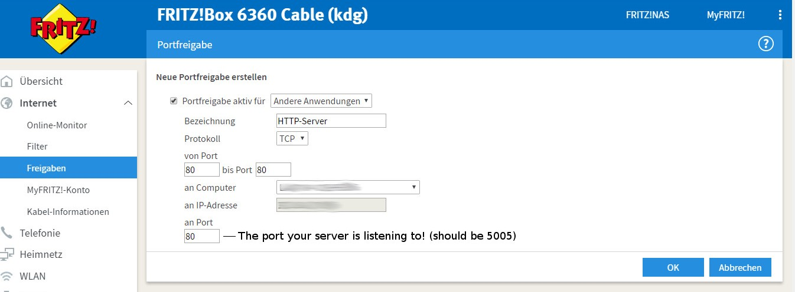

# Sonos Integration with Alexa Echo

## Introduction

The following steps show how we integrated the Alexa Echo Dot with the Sonos (based on guidelines from the [echo-sonos](https://github.com/rgraciano/echo-sonos/blob/master/lambda/src/sonosProxy/sonosProxyFactory.js) repository by rgraciano - but with an Alexa skill build in python instead of node.js).  

### Step 1: Get node-sonos-http-api Running on a Local Server

This step is assuming that you already got node.js and npm installed on your pc or device. 

Go to https://github.com/jishi/node-sonos-http-api. In the folder where you want run your server from do the following in the terminal (as explained by jishi):

`$ git clone https://github.com/jishi/node-sonos-http-api.git`

`$ cd node-sonos-http-api`

`$ npm install --production`

`$ npm start # or: node server.js`

Your server should now start running on http://localhost:5005.

You can try if it is working by putting the following links (which the name of the ROOM of your sonos instead of the "salon") in your browser:

 `http://localhost:5005/salon/play	`

`http://localhost:5005/salon/volume/50`

`http://localhost:5005/salon/next`

`http://localhost:5005/salon/pause`

**Tip**: in case you are running the sonos http server on a seperate device (in my case an orange pi), you can make it keep running even if you close the ssh terminal, with a npm package called [forever](https://github.com/foreverjs/forever). 

you can install it with the following command:

`$ [sudo] npm install forever -g`

Go to the folder where you installed the sonos server module

`$ cd node-sonos-http-api`

and type:

`$ forever start server.js`

### Step 2: Making Your Server Accessible for Alexa

For this step I am following the steps by Graciano in his [sonos-echo](https://github.com/rgraciano/echo-sonos) repository. 

1. I made an account on [ydsn.io](https://ydns.io/)

2. I confirmed the e-mail and [added a host](https://ydns.io/hosts/add) (the correct ip address for my internet was already there by default - great!).

3. Luckily, for FRITZ!box the steps of setting up a DynamicDSN were nicely documented on the ydsn.io website [here](https://ydns.io/knowledge-base/updating-domain-with-fritzbox). I just followed the steps.

4. Now - to set up the [Port Forwarding](https://en.avm.de/service/fritzbox/fritzbox-7390/knowledge-base/publication/show/893_Setting-up-static-port-sharing/), I went to "Portfreigaben" in the fritz.box > Internet > freigaben section and clicked `neue portfreigaben`.  And then I did the following:

   

5. Now the sonos should be controlable even from outside the local network! I tested it by visiting the link in the browser from my phone data network (not via the wifi):

   `<THE_DOMAIN_NAME_I_JUST_MADE>/salon/next`

   If it returns `{"status"}:{"success"}` then you know you did it right!
   ​

### Step 3: Get Your Alexa Skill Running

For creating an Alexa skill you need two things:
1) an amazon [developer](developer.amazon.com) account
2) an [aws](aws.amazon.com) account (you can create an account for free - you will need an creditcard to register though).

For an detailed explanation of how to get started with building an Alexa skill, see this [tutorial](https://github.com/alexa/skill-sample-nodejs-fact). 

In your developer account, go to Alexa > Alexa Skills Kit > Add a New Skill. Select a language, put a name and an invocation name for your skill. Voila, continue to `Interaction Model` and copy paste the content of the [intent_schema.json](intent_schema.json) into the field. Now click `Add Slot Type` and enter the content from the [LIST_OF_ITEMS_ONE.txt](LIST_OF_ITEMS_ONE.txt) and name the slot type LIST_OF_ITEMS_ONE. Now, add the [sample utterances](sample_utterances.txt).

Before we continue to the next step in the Alexa Skill, we need to set up the lambda function in aws. Go to your aws account and look for Lambda. 
- Click on Create New Lambda Function > Blank Blueprint > select Alexa Skills Kit as your trigger. 
- In Configure Function give your function a name and select Python 2.7. 
- Now we can enter the code for the lambda function. Here we can insert the code from the [lambda_function.py](lambda_function.py) file. Do not forget to change the parts where it says `<YOUR_SONOS_SERVER_DOMAIN>` and `<ROOM_NAME>` with the domain name of your sonos http api server and the room name of your sonos. You can also fill in your Alexa Application ID in the top (you can find it this in your Alexa Skill, looks something like amzn1.ask.skill.XXXXXXXX...) - however, you can also do this later.
- In Role select _Create a custom role_ and allow. Now you can just go on and finish your lambda function. 
- Once you have created your function - copy the ARN code (looks like arn:aws:lambda:eu-west-1:XXXXXXX...)

Now - back to the skill in your developer account. In `Configuration` select _AWS Lambda ARN (Amazon Resource Name)_ (unless you are not planning to working with aws lambda of course), select your region and paste the ARN code in the field. 

Now you can start testing your skill!

