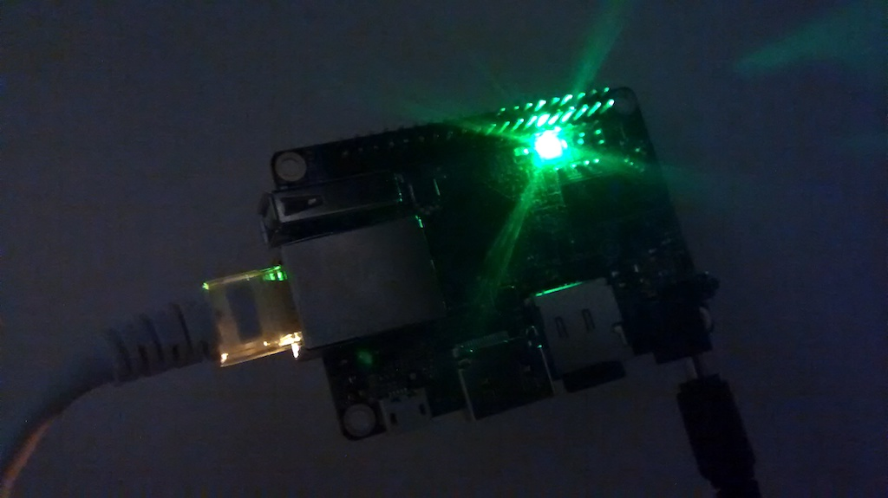

# How to Deploy the Project in an Orange Pi One

## Introduction

The [Orange Pi One](http://www.orangepi.org/orangepione/) is an affordable open-source single-board computer based on the AllWinner H3 SoC (System on Chip), that counts with a 512MB DDR3 SDRAM. Since it's [one of the cheapest](https://www.aliexpress.com/store/product/Orange-Pi-One-ubuntu-linux-and-android-mini-PC-Beyond-and-Compatible-with-Raspberry-Pi-2/1553371_32603308880.html) *devkits* out there, it's a great option for DIY projects.

This document explains how to deploy this project, i.e. the [Sonos HTTP API](https://github.com/jishi/node-sonos-http-api) server, as well as the [Node.js scripts](./nodejs-scripts) to fire requests and control your Sonos speakers using sensor data or other events.

In this tutorial, we will be using **Armbian version 5.25**, a flavor based on Debian Jessie 3.4.113, specifically built for the Orange Pi One. Please note that this document applies to the **server version**, so **no graphical interface** will be available by default.

## Requirements

The following hardware is required:

* [Orange Pi One](https://www.aliexpress.com/store/product/Orange-Pi-One-ubuntu-linux-and-android-mini-PC-Beyond-and-Compatible-with-Raspberry-Pi-2/1553371_32603308880.html)
* 4GB SD Card (8GB is strongly recommended)
* A decent 5V/2A USB power supply (like [this one](https://www.amazon.de/dp/B00JWXT6BK/ref=cm_sw_em_r_mt_dp_TIjTyb0T3E30H))
* A USB to 4.0x1.7mm DC jack cable (like [this one](http://tinkersphere.com/power/1746-orange-pi-power-cable-usb.html))

Please note that other power supplies may work, but your board could find issues booting or experience several instabilities. Also, note the USB to jack converter, which is the only one that fits well, and not easy to source.

## Installation & Configuration

### Burn Armbian in an SD Card

1. Download Armbian from the [official project source](https://www.armbian.com/orange-pi-one/). Click on the `Server` tab, and then on `Debian Jessie` to start the download.
2. Once ready, unzip the downloaded file with your program of choice (e.g. [7-Zip](http://www.7-zip.org) on Linux and Windows, or [The Unarchiver](https://itunes.apple.com/us/app/the-unarchiver/id425424353?mt=12) on OS X). For additional explanations, refer to the [official guide](https://www.armbian.com/orange-pi-one/), under the tab `Quick Start`.
3. Insert the SD card in your computer and format it with [SD Formatter](https://www.sdcard.org/downloads/formatter_4/). Make sure that you run an **overwrite format**, and not a quick format. This is a slow process and may take a few minutes.
4. Burn the image with Etcher. Simply select the file with the extension `.img` in the folder where you unzipped the contents of the downloaded package, and follow the on-screen instructions.

### Network Configuration

*Hotplug* Ethernet and DHCP will work by default, so if you hook the board up to one of the ports of your router, it will get an IP address automatically.

Please note that running `ifconfig` will not work, as it does not come by default, so you will need to install it if you need it. However, if you only need basic information, like finding out the **IP address of your Orange Pi**, use the command `ip addr`.

### Install Node.js and npm

We've experienced issues with Node.js v7, so this tutorial will cover the installation of Node.js and npm (Node Package Manager) v6. These instructions are based on the official Node.js documentation, that can be found [here](https://nodejs.org/en/download/package-manager/#debian-and-ubuntu-based-linux-distributions).

On the terminal login and run the following command to **download the package**:  
`$ curl -sL https://deb.nodesource.com/setup_6.x | sudo -E bash -`

Now, to **proceed with the installation**, simply run:  
`$ sudo apt-get install -y nodejs`

Once ready, to make sure that Node.js has been properly installed, you can check the version with the command `node -v`. Same happens with npm; find out the current version running `npm -v`.

### Install the Sonos HTTP API

On the next steps we will be getting ready the excellent [Sonos HTTP API](https://github.com/jishi/node-sonos-http-api) from [Jimmy Shimizu](https://github.com/jishi).

On the home folder of your Orange Pi, clone
the repository by running the following command:  
`$ git clone https://github.com/jishi/node-sonos-http-api.git`

Now head to the folder with:  
`$ cd node-sonos-http-api`

We will need to download and install the required dependencies. For that, simply run:  
`$ npm install --production`

If everything went well, the server will be ready to roll, and it can be tested already. But since we will be *firing* HTTP requests to such server, first we need to find out the IP address of the board. For that, simply run:  
`$ ip addr`

Write down the IP address of your Orange Pi. Below, we will refer to this IP address as `<ORANGE_PI_IP_ADDRESS>`. If you are in your home network, and you didn't change the default configuration, it will probably look like 192.168.178.XXX.

Now, start the server with the command:  
`$ npm start`

**Note:** This command actually only runs the file `server.js`. This will be helpful to later configure the *forever* service on the board.

Now, just leave the board running (i.e. **do not logout yet**), open a browser in your computer, and head to the following URLs to check if your Sonos speaker responds to the HTTP requests.

This one will turn the volume up to 75%:  
`http://<ORANGE_PI_IP_ADDRESS>:5005/volume/75`

And this one will play the current queue:  
`http://<ORANGE_PI_IP_ADDRESS>:5005/play`

If everything worked well, and depending on your musical taste, everyone at home will be awake now. And maybe your neighbors too... ;)

### Scripts for Sensor Integration

##### ------------WORK IN PROGRESS------------

Now that we can send commands to the Sonos speaker(s), it's also possible to build integrations with other devices easily. In the folder `nodejs-scripts` you will find a set of scripts for different applications.

These scripts subscribe to readings sent by sensor nodes via [MQTT](https://en.wikipedia.org/wiki/MQTT). For more information, just check the documentation provided in [such folder](../nodejs-scripts/).

To run the scripts on your Orange Pi, first go to the folder running the command:  
`$ cd ../nodejs-scripts/`

Once there, simply run:  
`$ node <SCRIPT_NAME>`

For example, to run the first example, which will make the Sonos play music automatically when you come home, use the following invocation:  
`$ node nodejs-01-welcome-home.js`

However, if the Orange Pi is reset, or if it loses power accidentally, the scripts will stop working, so in the next section we will learn how to *automate* the initialization of all services once the system boots up.

### Run the Server and the Scripts on Bootup

##### ------------WORK IN PROGRESS------------

## Shutting Down the System

If you want to turn off your Orange Pi, **do not disconnect the Orange from the power supply**, as this may corrupt the file system. Instead, to halt the board immediately, while *ssh'ing* it, run the following command:  
`$ sudo shutdown -h now`

## To Do

* How to SSH'ing

## License

Copyright (C) 2017 Emelie Hofland <emelie_hofland@hotmail.com>, Jaime González-Arintero <a.lie.called.life@gmail.com>

Permission is hereby granted, free of charge, to any person obtaining a copy of this software and associated documentation files (the "Software"), to deal in the Software without restriction, including without limitation the rights to use, copy, modify, merge, publish, distribute, sublicense, and/or sell
copies of the Software, and to permit persons to whom the Software is furnished to do so, subject to the following conditions:

The above copyright notice and this permission notice shall be included in all copies or substantial portions of the Software.

Except as contained in this notice, the name(s) of the above copyright holders shall not be used in advertising or otherwise to promote the sale, use or
other dealings in this Software without prior written authorization.

THE SOFTWARE IS PROVIDED "AS IS," WITHOUT WARRANTY OF ANY KIND, EXPRESS OR IMPLIED, INCLUDING BUT NOT LIMITED TO THE WARRANTIES OF MERCHANTABILITY,
FITNESS FOR A PARTICULAR PURPOSE AND NONINFRINGEMENT.  IN NO EVENT SHALL THE AUTHORS OR COPYRIGHT HOLDERS BE LIABLE FOR ANY CLAIM, DAMAGES OR OTHER
LIABILITY, WHETHER IN AN ACTION OF CONTRACT, TORT OR OTHERWISE, ARISING FROM, OUT OF OR IN CONNECTION WITH THE SOFTWARE OR THE USE OR OTHER DEALINGS IN THE
SOFTWARE.